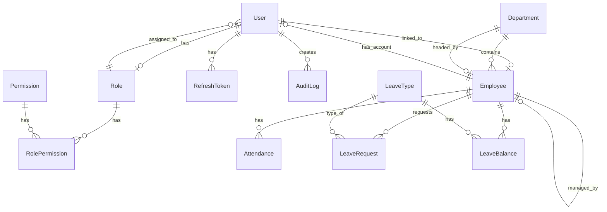

# HR Enterprise Backend Documentation

## 🧠 Architectural Style

**Pattern:** Modular Monolith (Domain-Driven Structure)

The backend is organized by business domains rather than technical layers. Each domain is an isolated NestJS module with its own controllers, services, and DTOs.

---

## 🏗️ Current Root Structure

```
backend/
│
├── prisma/
│   ├── schema.prisma          # Database schema
│   ├── seed.ts                # Database seeding
│   └── migrations/            # Migration files
│
├── generated/
│   └── prisma/                # Generated Prisma client
│
├── src/
│   ├── main.ts                # Application entry point
│   ├── app.module.ts          # Root module
│   │
│   ├── config/
│   │   ├── configuration.ts   # Configuration factory
│   │   └── validation.ts      # Environment validation
│   │
│   ├── database/
│   │   ├── prisma.service.ts  # Prisma client wrapper
│   │   └── prisma.module.ts   # Global database module
│   │
│   ├── common/
│   │   ├── decorators/        # Custom decorators
│   │   ├── guards/            # Authentication guards
│   │   ├── filters/           # Exception filters
│   │   ├── interceptors/      # Request/response interceptors
│   │   ├── pipes/             # Custom pipes
│   │   └── utils/             # Utility functions
│   │
│   ├── auth/                  # ✅ Authentication module
│   ├── users/                 # ✅ Users module
│   ├── rbac/                  # ✅ Role-based access control
│   ├── employees/             # ✅ Core HR module
│   ├── departments/           # ✅ Departments module
│   ├── attendance/            # ✅ Attendance tracking
│   ├── leave/                 # ✅ Leave management
│   │
│   └── shared/
│       ├── audit/             # ✅ Audit logging
│       └── errors/            # Custom error classes
│
└── test/                      # E2E tests
```

---

## 🏛️ Implemented Foundation Layer

### 🔹 Config Module

**Status:** ✅ Implemented

Uses `@nestjs/config` with Joi validation.

**Environment Variables:**
- `PORT` - Server port (default: 3002)
- `NODE_ENV` - Environment mode
- `CORS_ORIGIN` - CORS origin URL
- `DATABASE_URL` - PostgreSQL connection string
- `JWT_SECRET` - JWT signing secret
- `JWT_EXPIRATION` - Access token expiry (e.g., `15m`)
- `JWT_REFRESH_SECRET` - Refresh token secret
- `JWT_REFRESH_EXPIRATION` - Refresh token expiry (e.g., `7d`)
- `BCRYPT_ROUNDS` - Password hashing rounds
- `RATE_LIMIT_TTL` - Rate limit window
- `RATE_LIMIT_MAX` - Max requests per window

### 🔹 Database Layer

**Status:** ✅ Implemented

- **Prisma ORM** with PostgreSQL
- **Driver Adapter** (`@prisma/adapter-pg`) for Prisma 7.x compatibility
- Connection pooling via pg Pool
- Graceful shutdown handling
- Query logging in development

### 🔹 Global Infrastructure

**Guards:**
| Guard | Status | Description |
|-------|--------|-------------|
| `JwtAuthGuard` | ✅ | Validates JWT tokens |
| `RolesGuard` | ✅ | Checks user roles |
| `PermissionsGuard` | ✅ | Checks user permissions |

**Interceptors:**
| Interceptor | Status | Description |
|-------------|--------|-------------|
| `LoggingInterceptor` | ✅ | Logs request/response |
| `TransformInterceptor` | ✅ | Standardizes API responses |

**Filters:**
| Filter | Status | Description |
|--------|--------|-------------|
| `HttpExceptionFilter` | ✅ | Catches HTTP exceptions |
| `PrismaExceptionFilter` | ✅ | Handles Prisma errors |

**Pipes:**
| Pipe | Status | Description |
|------|--------|-------------|
| `ValidationPipe` | ✅ | Global validation (built-in) |
| `ParseUUIDPipe` | ✅ | UUID validation |

---

## 📊 Database Schema

### Entity Relationship Diagram



### Implemented Entities

| Entity | Status | Description |
|--------|--------|-------------|
| `User` | ✅ | System user accounts |
| `RefreshToken` | ✅ | JWT refresh tokens |
| `Role` | ✅ | User roles |
| `Permission` | ✅ | Granular permissions |
| `RolePermission` | ✅ | Role-permission mapping |
| `Department` | ✅ | Organizational departments |
| `Employee` | ✅ | Employee records |
| `Attendance` | ✅ | Daily attendance records |
| `LeaveType` | ✅ | Leave categories |
| `LeaveBalance` | ✅ | Employee leave balances |
| `LeaveRequest` | ✅ | Leave applications |
| `AuditLog` | ✅ | System audit trail |

---

## 🔐 Authentication Module

**Status:** ✅ Fully Implemented

### Features

| Feature | Status | Endpoint |
|---------|--------|----------|
| User Registration | ✅ | `POST /auth/register` |
| User Login | ✅ | `POST /auth/login` |
| Token Refresh | ✅ | `POST /auth/refresh` |
| Logout | ✅ | `POST /auth/logout` |
| Logout All Sessions | ✅ | `POST /auth/logout-all` |
| Change Password | ✅ | `POST /auth/change-password` |

### JWT Token Payload

```json
{
  "sub": "userId",
  "email": "user@example.com",
  "roleId": "role-uuid",
  "roleName": "admin",
  "employeeId": "employee-uuid",
  "permissions": ["employee:read", "employee:write"]
}
```

### Security Features

- ✅ bcrypt password hashing
- ✅ Refresh token rotation
- ✅ Token revocation on logout
- ✅ Session invalidation on password change
- ✅ Last login tracking

---

## 👤 Users Module

**Status:** ✅ Fully Implemented

### Features

| Feature | Status | Endpoint |
|---------|--------|----------|
| List Users | ✅ | `GET /users` |
| Get User by ID | ✅ | `GET /users/:id` |
| Create User | ✅ | `POST /users` |
| Update User | ✅ | `PATCH /users/:id` |
| Deactivate User | ✅ | `DELETE /users/:id` |
| Reset Password | ✅ | `POST /users/:id/reset-password` |
| Assign Role | ✅ | `POST /users/:id/role` |

### User-Employee Linking

- Users can be linked to employee records
- One-to-one relationship
- Automatic validation to prevent duplicate links

---

## 🛡️ RBAC Module

**Status:** ✅ Fully Implemented

### Features

| Feature | Status | Endpoint |
|---------|--------|----------|
| List Roles | ✅ | `GET /rbac/roles` |
| Get Role by ID | ✅ | `GET /rbac/roles/:id` |
| Create Role | ✅ | `POST /rbac/roles` |
| Update Role | ✅ | `PATCH /rbac/roles/:id` |
| Delete Role | ✅ | `DELETE /rbac/roles/:id` |
| List Permissions | ✅ | `GET /rbac/permissions` |
| Create Permission | ✅ | `POST /rbac/permissions` |
| Assign Permissions to Role | ✅ | `POST /rbac/roles/:id/permissions` |

### Permission Format

Permissions follow the pattern: `resource:action`

Examples:
- `employee:read`
- `employee:write`
- `attendance:manage`
- `leave:approve`

### Authorization Decorators

```typescript
// Role-based access
@Roles('admin', 'hr')

// Permission-based access
@Permissions('employee:write')
```

---

## 🧍 Employees Module (Core HR)

**Status:** ✅ Fully Implemented

### Features

| Feature | Status | Endpoint |
|---------|--------|----------|
| List Employees | ✅ | `GET /employees` |
| Get Employee by ID | ✅ | `GET /employees/:id` |
| Create Employee | ✅ | `POST /employees` |
| Update Employee | ✅ | `PATCH /employees/:id` |
| Delete Employee | ✅ | `DELETE /employees/:id` |
| Assign Manager | ✅ | `POST /employees/:id/manager` |
| Get Team Members | ✅ | `GET /employees/:id/team` |
| Get Org Hierarchy | ✅ | `GET /employees/:id/hierarchy` |

### Employee Fields

| Field | Type | Description |
|-------|------|-------------|
| `employeeCode` | String | Unique employee ID |
| `firstName` | String | First name |
| `lastName` | String | Last name |
| `email` | String | Work email |
| `phone` | String? | Phone number |
| `departmentId` | String? | Department reference |
| `designation` | String? | Job title |
| `managerId` | String? | Manager reference |
| `dateOfJoining` | DateTime | Joining date |
| `employmentStatus` | String | active/inactive/terminated |

### Business Rules Implemented

- ✅ Unique employee code validation
- ✅ Unique email validation
- ✅ Department existence validation
- ✅ Manager existence validation
- ✅ Self-reference prevention for manager
- ✅ Filter by department, manager, status
- ✅ Search by name, code, email

---

## 🏢 Departments Module

**Status:** ✅ Fully Implemented

### Features

| Feature | Status | Endpoint |
|---------|--------|----------|
| List Departments | ✅ | `GET /departments` |
| Get Department by ID | ✅ | `GET /departments/:id` |
| Create Department | ✅ | `POST /departments` |
| Update Department | ✅ | `PATCH /departments/:id` |
| Delete Department | ✅ | `DELETE /departments/:id` |
| Assign Department Head | ✅ | `POST /departments/:id/head` |

### Business Rules Implemented

- ✅ Unique department name
- ✅ One employee can only head one department
- ✅ Cannot delete department with employees
- ✅ Employee count included in responses

---

## 🕒 Attendance Module

**Status:** ✅ Fully Implemented

### Features

| Feature | Status | Endpoint |
|---------|--------|----------|
| Check In | ✅ | `POST /attendance/check-in` |
| Check Out | ✅ | `POST /attendance/check-out` |
| Create Manual Entry | ✅ | `POST /attendance` |
| Update Attendance | ✅ | `PATCH /attendance/:id` |
| Get Attendance by ID | ✅ | `GET /attendance/:id` |
| List Attendance Records | ✅ | `GET /attendance` |
| Get Employee Attendance | ✅ | `GET /attendance/employee/:employeeId` |
| Get Attendance Summary | ✅ | `GET /attendance/summary/:employeeId` |

### Attendance Status Types

| Status | Description |
|--------|-------------|
| `present` | Checked in on time |
| `late` | Checked in after 9:15 AM |
| `half-day` | Worked less than 4 hours |
| `absent` | No check-in |
| `on-leave` | Approved leave |

### Business Logic

- ✅ IST timezone handling (UTC+5:30)
- ✅ Late threshold: 9:15 AM
- ✅ Standard work hours: 8 hours
- ✅ Half-day threshold: 4 hours
- ✅ Automatic late minutes calculation
- ✅ Automatic overtime calculation
- ✅ Prevent double check-in
- ✅ Validate check-out after check-in

### Attendance Summary

Returns aggregated statistics:
- Total working days
- Present days
- Late days
- Absent days
- Half days
- On-leave days
- Average work hours
- Total overtime

---

## 🏖️ Leave Module

**Status:** ✅ Fully Implemented

### Leave Types

| Feature | Status | Endpoint |
|---------|--------|----------|
| List Leave Types | ✅ | `GET /leave/types` |
| Get Leave Type | ✅ | `GET /leave/types/:id` |
| Create Leave Type | ✅ | `POST /leave/types` |
| Update Leave Type | ✅ | `PATCH /leave/types/:id` |
| Delete Leave Type | ✅ | `DELETE /leave/types/:id` |

### Leave Type Fields

| Field | Type | Description |
|-------|------|-------------|
| `name` | String | Leave type name |
| `description` | String? | Description |
| `annualLimit` | Int | Days per year |
| `carryForwardAllowed` | Boolean | Can carry forward |
| `maxCarryForward` | Int? | Max carry forward days |

### Leave Requests

| Feature | Status | Endpoint |
|---------|--------|----------|
| List Leave Requests | ✅ | `GET /leave/requests` |
| Get Leave Request | ✅ | `GET /leave/requests/:id` |
| Apply for Leave | ✅ | `POST /leave/requests` |
| Approve Leave | ✅ | `POST /leave/requests/:id/approve` |
| Reject Leave | ✅ | `POST /leave/requests/:id/reject` |
| Cancel Leave | ✅ | `POST /leave/requests/:id/cancel` |
| Get My Leave Requests | ✅ | `GET /leave/requests/my` |
| Get Pending Approvals | ✅ | `GET /leave/requests/pending` |

### Leave Request Status

| Status | Description |
|--------|-------------|
| `pending` | Awaiting approval |
| `approved` | Approved by manager |
| `rejected` | Rejected by manager |
| `cancelled` | Cancelled by employee |

### Business Rules Implemented

- ✅ Leave balance validation
- ✅ Multi-day leave calculation
- ✅ Balance deduction on approval
- ✅ Balance restoration on rejection/cancellation
- ✅ Cannot approve own request
- ✅ Only pending requests can be approved/rejected
- ✅ Overlapping leave detection

### Leave Balance Management

| Feature | Status | Endpoint |
|---------|--------|----------|
| Get Employee Balances | ✅ | `GET /leave/balances/:employeeId` |
| Initialize Year Balances | ✅ | `POST /leave/balances/initialize` |
| Adjust Balance | ✅ | `POST /leave/balances/:id/adjust` |

---

## 📝 Audit Logging

**Status:** ✅ Implemented

### Features

| Feature | Status | Description |
|---------|--------|-------------|
| Log Actions | ✅ | Automatic logging of key actions |
| Query Logs | ✅ | Filter by user, entity, action, date |
| Entity History | ✅ | Get all logs for specific entity |

### Logged Information

- User who performed the action
- Action type (create, update, delete, etc.)
- Entity type and ID
- Old and new values (JSON)
- IP address
- User agent
- Timestamp

---

## 🔄 Background Jobs

**Status:** ⚠️ Partially Implemented

| Job | Status | Description |
|-----|--------|-------------|
| Mark Absentees | ⚠️ | Cron service exists but not fully integrated |

---

## 📈 API Response Format

All API responses follow a consistent format:

### Success Response

```json
{
  "success": true,
  "data": { ... },
  "meta": {
    "page": 1,
    "limit": 10,
    "total": 100,
    "totalPages": 10
  }
}
```

### Error Response

```json
{
  "success": false,
  "statusCode": 400,
  "message": "Validation failed",
  "error": "Bad Request"
}
```

---

## 🔒 Security Features

| Feature | Status | Description |
|---------|--------|-------------|
| Helmet | ✅ | HTTP headers security |
| CORS | ✅ | Configured CORS origin |
| Rate Limiting | ✅ | Configurable rate limits |
| Password Hashing | ✅ | bcrypt with configurable rounds |
| JWT Authentication | ✅ | Access + refresh tokens |
| Role-Based Access | ✅ | Role guard |
| Permission-Based Access | ✅ | Permission guard |
| Input Validation | ✅ | class-validator DTOs |

---

## 🆚 Comparison with Target Architecture

### ✅ Implemented Modules

| Module | Target | Current | Status |
|--------|--------|---------|--------|
| Auth | Full | Full | ✅ Complete |
| Users | Full | Full | ✅ Complete |
| RBAC | Full | Full | ✅ Complete |
| Employees | Full | Full | ✅ Complete |
| Departments | Full | Full | ✅ Complete |
| Attendance | Full | Full | ✅ Complete |
| Leave | Full | Full | ✅ Complete |
| Audit | Full | Full | ✅ Complete |

### ❌ Not Yet Implemented

| Module | Target Features | Status |
|--------|-----------------|--------|
| **Payroll** | Salary structures, Payroll runs, Payroll entries, LOP calculation | ❌ Not Started |
| **Performance** | Goals, Performance reviews, Ratings | ❌ Not Started |
| **Recruitment** | Jobs, Candidates, Hiring pipeline | ❌ Not Started |
| **Compliance** | PF/ESI/TDS filings, Policy acknowledgements | ❌ Not Started |
| **Analytics** | Executive summary, Metrics, Dashboards | ❌ Not Started |
| **Workflow** | Generic approval engine | ❌ Not Started |

---

## 📋 What Needs to be Done

### 🔴 High Priority - Core Business Modules

#### 1. Payroll Module

**Entities Required:**
```
SalaryStructure
- id, name, basic, hra, allowances, professionalTax, pf, esi

PayrollRun
- id, month, year, status (draft/approved/processed), approvedBy, processedAt

PayrollEntry
- id, payrollRunId, employeeId, grossSalary, lopDays, deductions, netSalary
```

**Features to Implement:**
- [ ] Create salary structures
- [ ] Assign salary structures to employees
- [ ] Create payroll runs (monthly)
- [ ] Calculate payroll entries
- [ ] Handle LOP (Loss of Pay) deductions
- [ ] Approve payroll
- [ ] Lock processed payroll
- [ ] Generate payslips

**Business Rules:**
- Cannot process payroll twice for same month
- Cannot modify approved payroll
- LOP calculation based on attendance
- PF, ESI, Professional Tax calculations

#### 2. Performance Module

**Entities Required:**
```
Goal
- id, employeeId, title, targetValue, achievedValue, weightage, status

PerformanceReview
- id, employeeId, reviewerId, rating, comments, reviewDate
```

**Features to Implement:**
- [ ] Create goals for employees
- [ ] Update goal progress
- [ ] Submit performance reviews
- [ ] Calculate performance scores
- [ ] Review cycle management

### 🟡 Medium Priority - Extended Features

#### 3. Recruitment Module

**Entities Required:**
```
Job
- id, title, departmentId, status, requirements

Candidate
- id, name, email, phone, resumeUrl, stage, appliedDate
```

**Features to Implement:**
- [ ] Create job postings
- [ ] Track candidates
- [ ] Move candidates through stages
- [ ] Convert candidate to employee

#### 4. Compliance Module

**Entities Required:**
```
FilingRecord
- id, type (PF/ESI/TDS), period, status, filedAt

PolicyAcknowledgement
- id, employeeId, policyName, acknowledgedAt
```

**Features to Implement:**
- [ ] Track statutory filings
- [ ] Filing reminders
- [ ] Policy acknowledgement tracking
- [ ] Compliance dashboard

#### 5. Analytics Module

**Features to Implement:**
- [ ] Executive summary endpoint
- [ ] Attendance metrics
- [ ] Payroll metrics
- [ ] Attrition rate calculation
- [ ] Department-wise analytics
- [ ] Cached aggregations

### 🟢 Lower Priority - Enhancements

#### 6. Workflow Module

**Entities Required:**
```
Approval
- id, entityType, entityId, currentStep, status, approvedBy, approvedAt
```

**Features to Implement:**
- [ ] Generic approval workflow engine
- [ ] Multi-level approvals
- [ ] Approval history

#### 7. Background Jobs Enhancement

**Jobs to Add:**
- [ ] Daily absentee marking cron
- [ ] Monthly leave accrual
- [ ] Payroll auto-lock
- [ ] Analytics cache refresh

#### 8. Additional Enhancements

- [ ] Email notifications
- [ ] File upload service (for documents, resumes)
- [ ] Employee documents management
- [ ] Company calendar
- [ ] Holidays management
- [ ] Shift management
- [ ] Expense claims

---

## 🗂️ Recommended Implementation Order

1. **Payroll Module** - Critical for HR operations
2. **Performance Module** - Employee development tracking
3. **Analytics Module** - Management insights
4. **Recruitment Module** - Hiring process
5. **Compliance Module** - Statutory requirements
6. **Workflow Module** - Process automation
7. **Background Jobs** - Automation
8. **Enhancements** - Additional features

---

## 🛠️ Technical Debt

1. **Tests** - E2E tests need to be written
2. **API Documentation** - Swagger/OpenAPI integration
3. **Performance Optimization** - Add database indexes
4. **Caching** - Redis integration for frequently accessed data
5. **Logging** - Structured logging with log levels
6. **Monitoring** - Health checks and metrics endpoints

---

## 📊 Current Implementation Status

```
Overall Progress: ~60%

Foundation Layer:     ████████████████████ 100%
Authentication:       ████████████████████ 100%
User Management:      ████████████████████ 100%
RBAC:                 ████████████████████ 100%
Core HR (Employees):  ████████████████████ 100%
Departments:          ████████████████████ 100%
Attendance:           ████████████████████ 100%
Leave Management:     ████████████████████ 100%
Audit Logging:        ████████████████████ 100%
Payroll:              ░░░░░░░░░░░░░░░░░░░░   0%
Performance:          ░░░░░░░░░░░░░░░░░░░░   0%
Recruitment:          ░░░░░░░░░░░░░░░░░░░░   0%
Compliance:           ░░░░░░░░░░░░░░░░░░░░   0%
Analytics:            ░░░░░░░░░░░░░░░░░░░░   0%
Workflow:             ░░░░░░░░░░░░░░░░░░░░   0%
```

---

## 🚀 Quick Start

```bash
# Install dependencies
pnpm install

# Set up environment
cp .env.example .env

# Run migrations
pnpm db:migrate

# Seed database
pnpm db:seed

# Start development server
pnpm start:dev
```

---

## 📝 License

Private - HR Enterprise System
