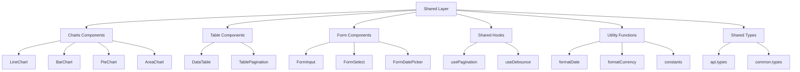
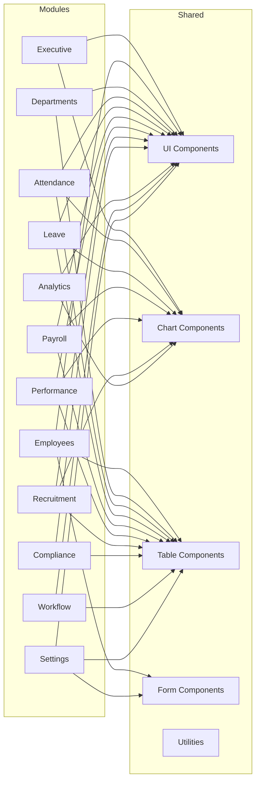

# Frontend Implementation Plan

## Current State Analysis

### Already Completed

#### App Layer (100%)
- `router.tsx` - Complete with lazy-loaded routes and permission checks
- `providers.tsx` - QueryClient and AuthProvider setup

#### Config Layer (100%)
- `env.ts` - Environment configuration
- `routes.ts` - Route definitions
- `navigation.ts` - Navigation items with permissions

#### Core Layer (100%)
- `api/axios.ts` - Axios instance with JWT interceptors
- `api/api-client.ts` - API client
- `auth/auth-context.tsx` - Auth context with user, permissions
- `auth/auth-service.ts` - Auth service
- `auth/protected-route.tsx` - Protected route component
- `rbac/permission-hook.ts` - usePermission hook
- `rbac/role-utils.ts` - Role utilities
- `layout/Sidebar.tsx` - Sidebar component
- `layout/Header.tsx` - Header component
- `layout/DashboardLayout.tsx` - Dashboard layout
- `types/user.types.ts` - User types

#### Shared Layer (40%)
**Completed:**
- `components/ui/Button.tsx`
- `components/ui/Card.tsx`
- `components/ui/Modal.tsx`
- `components/ui/Badge.tsx`
- `components/ui/Spinner.tsx`
- `utils/cn.ts`

**Missing:**
- `components/charts/` - LineChart, BarChart, PieChart, AreaChart
- `components/tables/` - DataTable, TablePagination
- `components/forms/` - FormInput, FormSelect, FormDatePicker
- `hooks/` - usePagination, useDebounce
- `utils/` - formatDate, formatCurrency, constants
- `types/` - api.types, common.types

#### Modules (25%)
**Completed:**
- `executive/` - types, hooks, services, components, pages (100%)
- `employees/` - types, hooks, services, components, pages (100%)
- `departments/` - types, hooks, services, pages (100%)
- `attendance/` - types, hooks, services (60% - missing pages/components)

**Not Started:**
- `leave/`
- `payroll/`
- `performance/`
- `recruitment/`
- `compliance/`
- `analytics/`
- `workflow/`
- `settings/`

---

## Implementation Plan

### Phase 1: Complete Shared Layer



### Phase 2: Complete Attendance Module

Files needed:
- `pages/AttendanceDashboard.tsx`
- `pages/AttendanceList.tsx`
- `components/AttendanceSummaryCard.tsx`
- `components/AttendanceTable.tsx`
- `components/AttendanceHeatmap.tsx`
- `components/LateLoginCard.tsx`
- `components/OvertimeChart.tsx`

### Phase 3: Create Leave Module

```
modules/leave/
- types.ts
- services/leave.api.ts
- hooks/useLeave.ts
- pages/LeaveDashboard.tsx
- pages/LeaveRequests.tsx
- components/LeaveBalanceCard.tsx
- components/LeaveRequestTable.tsx
- components/LeaveTrendChart.tsx
- components/ApprovalList.tsx
- index.ts
```

### Phase 4: Create Payroll Module

```
modules/payroll/
- types.ts
- services/payroll.api.ts
- hooks/usePayroll.ts
- pages/PayrollDashboard.tsx
- pages/PayrollRuns.tsx
- pages/PayrollRunDetails.tsx
- components/PayrollTrendChart.tsx
- components/PayrollEntriesTable.tsx
- components/GrossNetBreakdown.tsx
- components/ApprovePayrollModal.tsx
- index.ts
```

### Phase 5: Create Performance Module

```
modules/performance/
- types.ts
- services/performance.api.ts
- hooks/usePerformance.ts
- pages/PerformanceDashboard.tsx
- pages/GoalsPage.tsx
- pages/ReviewsPage.tsx
- components/GoalProgressBar.tsx
- components/RatingChart.tsx
- components/PerformanceTable.tsx
- components/RatingDistributionChart.tsx
- index.ts
```

### Phase 6: Create Recruitment Module

```
modules/recruitment/
- types.ts
- services/recruitment.api.ts
- hooks/useRecruitment.ts
- pages/RecruitmentDashboard.tsx
- pages/JobsPage.tsx
- pages/CandidatesPage.tsx
- components/HiringFunnelChart.tsx
- components/CandidateDrawer.tsx
- components/StageProgressBar.tsx
- components/JobTable.tsx
- index.ts
```

### Phase 7: Create Compliance Module

```
modules/compliance/
- types.ts
- services/compliance.api.ts
- hooks/useCompliance.ts
- pages/ComplianceDashboard.tsx
- pages/FilingsPage.tsx
- components/FilingStatusCard.tsx
- components/ComplianceTimeline.tsx
- components/ExpiryAlertBanner.tsx
- index.ts
```

### Phase 8: Create Analytics Module

```
modules/analytics/
- types.ts
- services/analytics.api.ts
- hooks/useAnalytics.ts
- pages/AttritionAnalytics.tsx
- pages/DepartmentAnalytics.tsx
- components/AnalyticsCharts.tsx
- index.ts
```

### Phase 9: Create Workflow Module

```
modules/workflow/
- types.ts
- services/workflow.api.ts
- hooks/useWorkflow.ts
- pages/ApprovalsPage.tsx
- components/PendingApprovalsList.tsx
- components/ApprovalHistoryModal.tsx
- index.ts
```

### Phase 10: Create Settings Module

```
modules/settings/
- types.ts
- services/settings.api.ts
- hooks/useSettings.ts
- pages/RolesPage.tsx
- pages/PermissionsPage.tsx
- pages/SystemSettings.tsx
- components/RoleForm.tsx
- index.ts
```

---

## File Dependencies



---

## Execution Order

1. **Shared Layer Completion** - Foundation for all modules
2. **Attendance Module** - Complete partial module
3. **Leave Module** - HR core functionality
4. **Payroll Module** - Financial operations
5. **Performance Module** - Employee management
6. **Recruitment Module** - Hiring process
7. **Compliance Module** - Regulatory requirements
8. **Analytics Module** - Reporting and insights
9. **Workflow Module** - Approval processes
10. **Settings Module** - System configuration

---

## Notes

- All modules follow the same pattern: types, services, hooks, pages, components, index.ts
- Each page uses React Query for data fetching via module-specific hooks
- All API services use the shared axios instance from `core/api/axios.ts`
- Components use shared UI components from `shared/components/ui/`
- Charts use recharts library (already installed)
- TypeScript types are defined per module and exported via index.ts